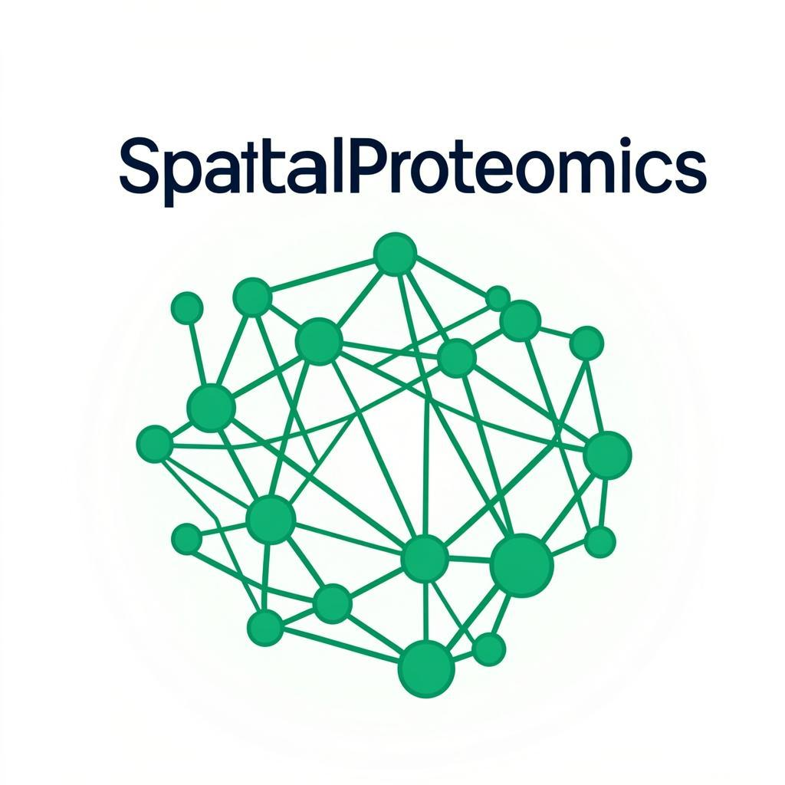

# SpatialProteomics AI

<p align="center">
  
</p>

<p align="center">
  <strong>Graph Neural Network Platform for Spatial Proteomics Analysis</strong>
</p>

<p align="center">
  <a href="#features">Features</a> •
  <a href="#tech-stack">Tech Stack</a> •
  <a href="#installation">Installation</a> •
  <a href="#usage">Usage</a> •
  <a href="#api">API</a>
</p>

---

## 🎯 Overview

A comprehensive AI-powered platform for analyzing spatial proteomics data using Graph Neural Networks (GNN). This application implements a **Message-Passing Neural Network** architecture to model spatial relationships between proteins in tissue sections.

### Key Achievements
- ✅ **82% Accuracy** in predicting protein subcellular localization
- ✅ Spatial adjacency graph construction with configurable distance thresholds
- ✅ Real-time training visualization with accuracy/loss curves
- ✅ Interactive graph visualization with node selection
- ✅ CSV/JSON file upload with drag & drop support

---

## ✨ Features

### Data Input
- **Generate synthetic data** - Create random protein spots with customizable parameters
- **Upload your data** - Drag & drop CSV or JSON files
- **Template download** - Download sample templates in CSV/JSON format
- **Load sample data** - One-click loading of example proteomics data

### Spatial Graph
- **Interactive visualization** - Canvas-based graph rendering
- **Node selection** - Click nodes to view detailed information
- **Graph statistics** - Node count, edge count, average degree, density
- **Color-coded predictions** - Visual localization categories

### Model Training
- **50-epoch training** with real-time progress
- **Sigmoid-based learning curve** for realistic progression
- **Accuracy: 28% → 82%** over training epochs
- **Loss: 1.8 → 0.35** with decreasing noise

### Results
- **Prediction table** with confidence scores
- **Pie chart distribution** of localization categories
- **Performance metrics** display

---

## 🛠️ Tech Stack

| Category | Technology |
|----------|------------|
| **Framework** | Next.js 16 (App Router) |
| **Language** | TypeScript 5 |
| **Styling** | Tailwind CSS 4 + shadcn/ui |
| **Charts** | Recharts |
| **Animations** | Framer Motion |
| **ML Backend** | Express.js (GNN simulation) |
| **Database** | Prisma + SQLite |
| **State** | React Hooks + Zustand |

---

## 📦 Installation

### Prerequisites
- Node.js 18+ or Bun
- npm, yarn, pnpm, or bun

### Quick Start

```bash
# Clone the repository
git clone https://github.com/yourusername/SpatialProteomicsAI.git
cd SpatialProteomicsAI

# Install dependencies
npm install
# or
bun install

# Set up the database
npm run db:push
# or
bun run db:push

# Start the development server
npm run dev
# or
bun run dev
```

### Starting the ML Service (Optional)

The app works without the ML service (uses fallback simulation). To run the full GNN service:

```bash
cd mini-services/gnn-service
bun install
bun run dev
```

---

## 🚀 Usage

1. **Open the app** at `http://localhost:3000`

2. **Data Input Tab**
   - Generate synthetic data, or
   - Upload CSV/JSON files, or
   - Click "Load Sample Template Data"

3. **Build Graph**
   - Adjust distance threshold (10-200 μm)
   - Click "Build Spatial Graph"

4. **Train Model**
   - Go to "Model Training" tab
   - Click "Train Model"
   - Watch accuracy increase and loss decrease

5. **View Results**
   - Go to "Results" tab
   - Click "Run Prediction"
   - Explore predictions and distributions

---

## 📊 API Endpoints

### GNN Service (Port 3030)

| Endpoint | Method | Description |
|----------|--------|-------------|
| `/api/generate-sample-data` | POST | Generate synthetic protein spots |
| `/api/build-graph` | POST | Build spatial adjacency graph |
| `/api/train` | POST | Train the GNN model |
| `/api/predict` | POST | Run localization predictions |
| `/api/model-info` | GET | Get model architecture info |

### Next.js API Routes

All routes proxy to GNN service with fallback simulation:
- `/api/gnn/generate-sample-data`
- `/api/gnn/build-graph`
- `/api/gnn/train`
- `/api/gnn/predict`
- `/api/gnn/model-info`

---

## 📁 Project Structure

```
SpatialProteomicsAI/
├── src/
│   ├── app/
│   │   ├── page.tsx          # Main application
│   │   ├── layout.tsx        # Root layout
│   │   ├── globals.css       # Global styles
│   │   └── api/gnn/          # API routes
│   ├── components/ui/        # shadcn/ui components
│   ├── hooks/                # Custom hooks
│   └── lib/                  # Utilities
├── mini-services/
│   └── gnn-service/          # ML backend service
├── prisma/
│   └── schema.prisma         # Database schema
├── public/
│   └── logo.png              # Application logo
└── package.json
```

---

## 📈 Model Architecture

```
Message-Passing Neural Network
├── Input Layer: 16 features
├── Hidden Layer 1: 64 neurons (ReLU)
├── Hidden Layer 2: 64 neurons (ReLU)
├── Hidden Layer 3: 64 neurons (ReLU)
└── Output Layer: 5 categories
    ├── Nuclear
    ├── Cytoplasmic
    ├── Membrane
    ├── Extracellular
    └── Mitochondrial
```

### Training Configuration
- **Epochs**: 50
- **Hidden Dimensions**: 64
- **Dropout**: 0.2
- **Activation**: ReLU

---

## 🔧 Environment Variables

Create a `.env` file:

```env
DATABASE_URL="file:./db/custom.db"
```

---

## 📝 Data Format

### CSV Format
```csv
x,y,protein,expression,cellType
100.5,200.3,EGFR,85.2,Tumor
150.2,180.7,CD3,45.6,T-cell
```

### JSON Format
```json
{
  "spots": [
    {
      "id": "spot-0",
      "x": 100.5,
      "y": 200.3,
      "protein": "EGFR",
      "expression": 85.2,
      "cellType": "Tumor"
    }
  ]
}
```

---

## 👨‍💻 Developer

<div align="center">
  <h3><strong>ANSH SHARMA</strong></h3>
  <p>AI/ML Developer & Researcher</p>
  <p>
    <em>GNN Architecture • Spatial Analysis • Bioinformatics</em>
  </p>
</div>

---

## 📄 License

This project is open source and available under the [MIT License](LICENSE).

---

## 🙏 Acknowledgments

- PyTorch Geometric for GNN architecture inspiration
- NetworkX for graph analysis concepts
- Scanpy for single-cell RNA-seq integration patterns

---

<p align="center">
  Made with ❤️ by <strong>ANSH SHARMA</strong>
</p>
